<h1 align="center">🌍 Hyperspectral Image Classification using 2D and 3D CNNs</h1>

---

### 🚀 Tech Stack
<p align="center">
  
  
  
  
  
</p>

---

## 📖 Project Overview  

Hyperspectral imaging records a complete spectrum at every pixel, creating a three-dimensional data cube with hundreds of narrow wavelength bands. Unlike conventional RGB images, this wealth of spectral detail provides a unique material signature, enabling the accurate detection and classification of land cover types such as vegetation, soil, water, and urban structures. Such fine grained mapping makes hyperspectral imaging a valuable tool for monitoring natural resources and supporting urban and environmental planning.  

This project focuses on **feature extraction and classification** of hyperspectral datasets, which includes **Indian Pines** and **Salinas**. The proposed pipeline incorporates essential **preprocessing steps** (radiometric and atmospheric corrections), **dimensionality reduction** through Principal Component Analysis (PCA), and **feature learning** using Convolutional Neural Networks (CNNs) with spatial attention mechanisms. By integrating both spectral and spatial characteristics, the model generates high quality pixel level classification maps that are both accurate and interpretable.  

The system further employs **post-processing filters** to refine predictions and evaluates performance using key metrics such as **overall accuracy, per-class precision, recall, and the Kappa coefficient**. By combining spectral and spatial information, the project demonstrates how advanced machine learning can transform raw hyperspectral data into actionable insights. Beyond strong results on benchmark datasets, this approach highlights the broader potential of hyperspectral imaging for **urban planning, resource management, and environmental monitoring**.  

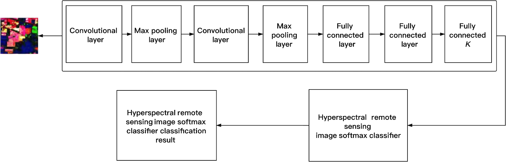 

---

## 📝 Problem Statement  

The goal of this project is to perform **feature extraction and classification of hyperspectral images** in order to provide reliable information for monitoring different natural resources in urban areas. Publicly available benchmark datasets such as **Indian Pines** and **Salinas** are used to evaluate and validate the proposed approach.  

---

## 🚀 Motivation  

Hyperspectral imaging records **hundreds of narrow spectral bands** at each pixel, it covers the details that are invisible in standard photos.  
By reducing noise and extracting the most informative features, similar pixels can be grouped and classified into categories such as **vegetation, water, or pavement**. This enables fast and accurate mapping of urban natural resources, supporting planners, scientists, and policymakers in **environmental monitoring and informed decision-making**.  

---

## 🎯 Objectives  

1. Study and compare different ways to pick out useful features from hyperspectral images.  
2. Try methods to reduce the huge amount of data into a smaller, meaningful set without losing key information.  
3. Look at different algorithms that can classify land-cover types and check which ones work best.  
4. Build and test machine learning and deep learning models to classify pixels in the images.  
5. Clearly define the problem of hyperspectral image classification for urban areas.  
6. Explore advanced techniques like using neighbourhood similarity and mixing spectral features.  
7. Use well known datasets **Indian Pines, Salinas** to test our methods.  
8. Check performance carefully, measuring accuracy, precision/recall, and overall reliability.  

---
 
## 📂 Directory Structure

```
Hyperspectral-Image-Classification 

Hyperspectral-Image-Classification <br>
├── Data/ # Folder to store datasets (not pushed to GitHub) <br>
├── images/ # All figures, plots, and visualizations <br>
├── 2DD_NEW.ipynb # Jupyter Notebook for 2D CNN model <br>
├── 3D_NEW.ipynb # Jupyter Notebook for 3D CNN model <br>
├── requirements.txt # Python dependencies <br>
├── .gitignore # Ignored files and folders <br>
└── README.md # Project documentation <br>

```
--- 

## 🛠️ Installation & Setup

1. Clone the repository
   bash
   git clone https://github.com/ACM40960/Hyperspectral-Image-Classification.git
   cd Hyperspectral-Image-Classification

2. (Optional) Create a virtual environment
python -m venv env
source env/bin/activate   # On Linux/Mac
env\Scripts\activate      # On Windows

3. Install dependencies
pip install -r requirements.txt

4. Download datasets
Place the hyperspectral datasets (e.g., Indian Pines, Salinas) inside the Data/ folder.
(Datasets are not included in the repo due to size restrictions.)

5. Run Jupyter Notebooks

jupyter notebook

Open 2DD_NEW.ipynb or 3D_NEW.ipynb to train and evaluate the models.

---

## ⚙️ Methodology  

Our methodology follows a structured pipeline, starting from raw hyperspectral data acquisition to generating accurate land cover classification maps. The process involves **preprocessing, feature extraction, classification, and post-processing with evaluation metrics**.  

This study implements a deep learning based pipeline for hyperspectral image (HSI) classification using the **Indian Pines dataset** (145 × 145 pixels, 200 spectral bands). The methodology is divided into **two major stages**:  

1. **Preprocessing:** To improve data quality and reduce redundancy.  
2. **CNN Model Training & Classification:** To learn spectral spatial representations and classify pixels.  

---

## 🔍 Overview of the Approach  

Hyperspectral images capture hundreds of spectral bands per pixel. While this richness enables precise identification of materials, it also introduces the challenge of managing **high-dimensional, redundant, and noisy data**.  

To address this, our approach combines:  

- **Principal Component Analysis (PCA)** which reduces dimensionality efficiently while preserving critical spectral information.  
- **Convolutional Neural Networks (CNNs)** with **spatial attention mechanisms** which learn robust spectral spatial features.  
- **Post-processing techniques** with smoothing filters to refine classification maps.  

This fusion of **spectral reduction** and **spatial learning** ensures the system is both **computationally efficient** and **accurate**.  

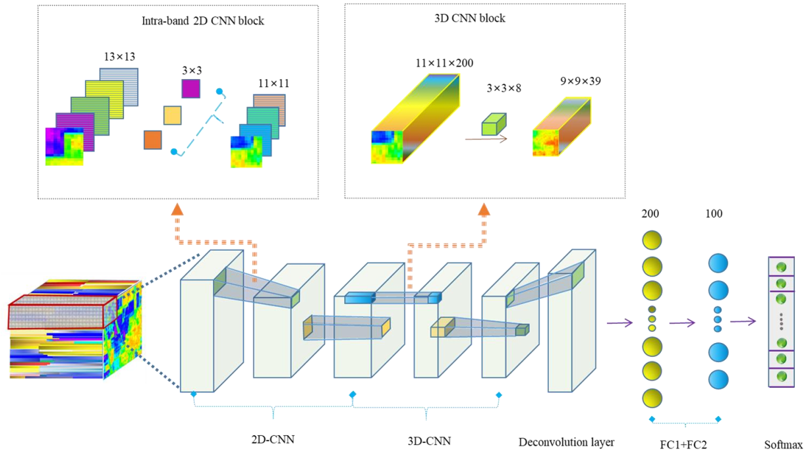  

---

## 📊 1. Data Collection

We use well established benchmark hyperspectral datasets:  

- **Indian Pines Dataset**  
  - AVIRIS sensor, northwest Indiana.  
  - 224 spectral bands (0.4–2.5 μm).  
  - 16 ground-truth classes (crops, grass, woods, urban).  

- **Salinas Scene Dataset**  
  - AVIRIS sensor, Salinas Valley, California.  
  - 224 bands at 3.7 m resolution.  
  - 16 classes (vegetation, crops, soil).  

- **AVIRIS Urban Scenes**  
  - Urban hyperspectral cubes.  
  - Includes man-made (asphalt, rooftops) and natural features.  

---

## 🔧 2.Preprocessing

Before training the model, the hyperspectral data needed to be cleaned and simplified so that it could be used effectively. Raw hyperspectral images usually contain hundreds of spectral bands, but many of these are either redundant or affected by atmospheric noise and sensor distortions. To tackle this, we first applied radiometric and atmospheric corrections, which convert the raw sensor values into surface reflectance. This ensures that the dataset represents real world ground conditions rather than being influenced by lighting variations or sensor errors.

Once the data was corrected, we focused on reducing its very high dimensionality. Using Principal Component Analysis (PCA), we were able to compress the dataset while still keeping more than 99% of the useful information. This step not only removed unnecessary bands but also made the training process much faster and more efficient. To prepare the data for the CNN models, we extracted fixed-size patches around each pixel and applied data augmentation techniques like rotations and flips. This helped balance the dataset by giving more representation to smaller classes, ensuring that the model could learn fairly across all land-cover types.

### 2.1 Radiometric & Atmospheric Correction
Convert raw sensor values to surface reflectance to remove sensor and atmospheric effects:  

$$
R(\lambda) = \frac{I_{\text{raw}}(\lambda) - I_{\text{dark}}(\lambda)}{I_{\text{white}}(\lambda) - I_{\text{dark}}(\lambda)}
$$

where $$\(I_{\text{white}}\)$$ and $$\(I_{\text{dark}}\)$$ are calibration references.

Radiometric and atmospheric correction is a crucial first step in hyperspectral image preprocessing. Raw hyperspectral data is often influenced by sensor noise, illumination variations, and atmospheric scattering, which can distort the spectral signatures of materials. To ensure that the measured values truly represent ground reflectance, calibration using white and dark reference panels is applied.  

---

### 2.2 Geometric Alignment (Band Registration)
Each spectral band is aligned to a common spatial grid so that the same $$x,y)\)$$ refers to the same ground location:  

$$
I_{\text{aligned}}(x,y,\lambda) = T_{\lambda}\big(I(x,y,\lambda)\big)
$$

where $$\(T_{\lambda}\)$$ is the estimated geometric transform for band $$\(\lambda\)$$.

This step ensures that every spectral band is perfectly aligned so that each pixel location $$\((x, y)\)$$ refers to the exact same ground point across all wavelengths. Without alignment, even small distortions between bands could confuse the model and lead to misclassification. By applying geometric transformations, we create a consistent hyperspectral cube where both spectral and spatial information are accurately preserved for further processing.

---

### 2.3 Dimensionality Reduction (PCA: Principle Component Analysis)

To reduce redundancy, data is projected onto the top $$\(k\)$$ principal components:  

$$
C = \frac{1}{n-1} X^\top X, \quad C v_i = \lambda_i v_i
$$

$$
Z = X V_k
$$

where $$\(X \in \mathbb{R}^{n \times d}\)$$ is the data matrix, $$\(V_k = [v_1, v_2, \dots, v_k]\)$$, and $$\(Z \in \mathbb{R}^{n \times k}\)$$ retains the most informative spectral variation.

Dimensionality reduction with PCA is applied to tackle with the curse of dimensionality in hyperspectral data. Since many adjacent spectral bands carry redundant information, PCA projects the original high dimensional data onto a smaller set of uncorrelated components that capture the majority of variance. This not only reduces computational complexity but also suppresses noise, making the features more robust for classification. In our project, retaining the top principal components preserves essential spectral spatial details while significantly improving efficiency for downstream CNN training.

---

## 🧠 3. CNN Model Architecture

In our project, two types of convolutional neural networks (CNNs) were explored to capture the spectral spatial characteristics of hyperspectral images.  

 - **2D CNN:** Extracts spatial features per band independently.  

The **2D CNN** was applied on spectral bands after dimensionality reduction using PCA. Each input patch was represented as a 2D image with reduced channels, and the convolutional layers learned spatial textures and edge like patterns within each band. This approach is computationally less intensive and works well when spectral redundancy has already been reduced, making it suitable for large scale experiments.  

- **3D CNN:** Captures joint spectral–spatial correlations.
  
The **3D CNN** input directly processed the hyperspectral data cube by treating both the spectral and spatial dimensions jointly. Instead of analyzing each band independently, the 3D kernels convolved across neighboring pixels and spectral bands simultaneously, enabling the network to capture subtle correlations between wavelength variations and spatial structures. This made the 3D CNN particularly powerful in learning complex class boundaries where spectral signatures alone were insufficient.  

By training both models under the same framework with categorical cross entropy loss and an SGD optimizer, we could compare their effectiveness. The 2D CNN achieved faster training and lower computational cost, while the 3D CNN produced richer feature representations and higher classification accuracy, especially in spectrally complex regions.

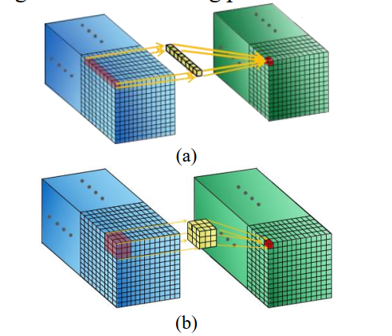 


---

## Step 3.1: Convolution Layer (Feature Extraction)

In our project, the convolution layer acted as the fundamental feature extractor for hyperspectral images. 

For **2D CNN:**

$$
Y(i,j,k) = \sigma \Bigg( \sum_{m=0}^{M-1} \sum_{n=0}^{N-1} \sum_{c=0}^{C-1} 
X(i+m, j+n, c) \cdot W(m,n,c,k) + b_k \Bigg)
$$

The convolution was applied on local pixel neighborhoods within each PCA reduced band. This helped the model learn spatial textures such as edges, shapes, and fine details across the scene, which are important for distinguishing land cover classes. 

For **3D CNN:**

$$
Y(x,y,z,k) = \sigma \Bigg( \sum_{d=0}^{D-1} \sum_{j=0}^{H-1} \sum_{i=0}^{W-1} 
X(x+i, y+j, z+l) \cdot W(i,j,l,k) + b_k \Bigg)
$$

The **3D CNN** extended this operation to the spectral dimension, where filters scanned across both space and wavelength simultaneously. This allowed the network to capture subtle correlations between spectral signatures and spatial patterns, leading to richer feature maps. 

Together, these convolution operations ensured that the models could automatically learn discriminative features without relying on handcrafted descriptors.

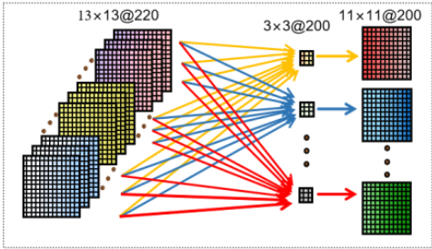 

---

## Step 3.2: Pooling Layer (Downsampling)

Reduces spatial size while retaining key features:

$$
Y(i,j,k) = \max_{(m,n)\in \Omega} \; X(i+m, j+n, k)
$$

The pooling layer was introduced to progressively reduce the spatial resolution of the feature maps while retaining the most important information. By applying max pooling, the model preserved the strongest activations that represent dominant spectral spatial patterns, while discarding redundant or less significant details. This not only reduced computational complexity but also improved robustness to small variations such as noise or slight misalignments in the hyperspectral data. The pooling operation therefore helped our CNN models focus on the most discriminative features required for accurate land-cover classification.

---

### Step 3.3: Fully Connected Layer

Flattens features for classification:

$$
y = \sigma ( W \cdot x + b )
$$

The fully connected layer acted as the final decision making stage of the CNN. After convolution and pooling, the extracted spectral spatial features were flattened into a one dimensional vector and passed through dense connections. This enabled the network to combine information across all bands and spatial regions, effectively learning high-level class representations. The fully connected layer mapped these features to the output classes such as different land-cover types in the Indian Pines dataset ensures that the network could perform accurate pixel wise classification.

---

### Step 3.4: Softmax Classifier

Outputs class probabilities:

$$
P(y = k \mid x) = \frac{\exp(z_k)}{\sum_{j=1}^{K} \exp(z_j)}
$$

The softmax layer was used as the final classification stage. It converted the raw output scores (logits) from the fully connected layer into normalized probability distributions across all land-cover classes. This allowed each pixel in the hyperspectral image to be assigned to the most likely class, while still providing probability estimates for all possible categories. By using softmax, the model not only predicted the most probable class but also provided confidence levels, which is crucial for evaluating uncertainty in hyperspectral image classification tasks.


---

### Step 3.5: Cross-Entropy Loss

Optimization objective for training:

$$
L = - \sum_{i=1}^{N} \sum_{k=1}^{K} y_{i,k} \; \log \hat{y}_{i,k}
$$

For training our CNN models, we employed the cross-entropy loss as the optimization objective. This loss function compares the predicted probability distribution with the true class labels, penalizing the model more heavily when the predicted probability for the correct class is low. By minimizing cross-entropy loss, the network effectively learns to maximize the likelihood of correctly classifying each pixel. In our project, this was particularly important given the large number of classes in hyperspectral datasets like Indian Pines, ensuring that the classifier became more discriminative and accurate over successive training epochs.

---

# 🔍 4. Training & Evaluation  

The training process was carefully designed to improve the generalization capability of our CNN models while handling the challenges of hyperspectral data, such as **high dimensionality** and **class imbalance**.  

---

### 4.1 📈 Data Augmentation  
Hyperspectral datasets like **Indian Pines** often suffer from limited labeled samples per class. To mitigate this, we applied **data augmentation** techniques such as random flips, rotations, and oversampling of minority classes. This balanced the dataset and improved robustness against spatial orientation changes and local distortions.  

---

### 4.2 ⚡ Optimizer – Stochastic Gradient Descent (SGD)  
We trained the models using **Stochastic Gradient Descent (SGD)**. At each iteration, the weights were updated as:  

$$
w_{t+1} = w_t - \eta \cdot \nabla L(w_t)
$$  

where:  

- $$\(w_t\)$$ → weight vector at iteration $$\(t\)$$  
- $$\(\eta\)$$ → learning rate  
- $$\(\nabla L(w_t)\)$$ → gradient of the cross-entropy loss  

A **learning rate scheduler** was applied for fast early convergence and stability at later stages.  

---

### 4.3 📊 Evaluation Metrics  
We used multiple performance metrics:  

- **Overall Accuracy (OA):**
  
OA = $$\frac{\text{Correct Predictions}}{\text{Total Samples}}$$  

- **Average Accuracy (AA):**
  
AA = $$\frac{1}{K} \sum_{k=1}^K \frac{TP_k}{N_k}$$
  
where $$\(TP_k\)$$ = correctly classified samples of class $$\(k\)$$, $$\(N_k\)$$ = total samples in class $$\(k\)$$.  

- **Kappa Coefficient:**  

$$\kappa\ = \frac{p_o - p_e}{1 - p_e}$$  

where $$\(p_o\)$$ = observed agreement (OA), $$\(p_e\)$$ = chance agreement.  

- **Precision & Recall:**
  
Precision = $$\frac{TP}{TP + FP}, \quad Recall = \frac{TP}{TP + FN}$$
  

- **F1 Score:**
  
F1 = 2 $$\cdot$$ $$\frac{Precision \cdot Recall}{Precision + Recall}$$
  

These ensured **both global accuracy and class-specific performance** were measured.  

---

### 4.4 ✅ Validation  
To validate the models, we generated:  
1. **Confusion Matrix** – showing per-class accuracy and misclassifications.  
2. **Classified Maps** – comparing predictions with ground truth for visual interpretation.  

This confirmed both **numerical performance** and **spatial coherence** in classification outputs.  

---

## 📊 5. Results & Evaluation  

### 5.1 Model Outputs  

**2D CNN Output**  
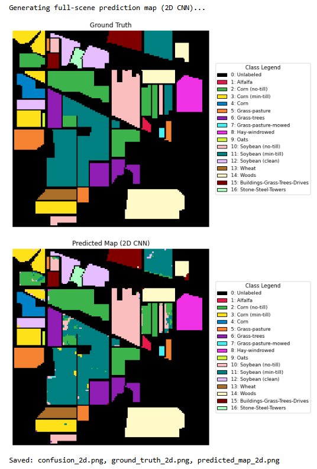  
**Interpretation:** The 2D CNN output map shows that while large homogeneous regions are captured, boundaries appear blurred and there are scattered misclassifications.  

**3D CNN Output**  
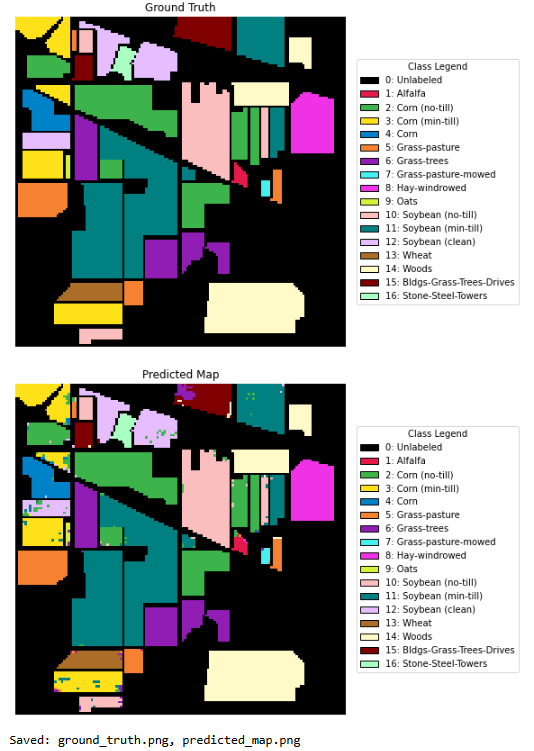  
**Interpretation:** The 3D CNN output demonstrates sharper class boundaries and fewer scattered misclassifications, indicating better spatial–spectral learning.  

---

### 5.2 Confusion Matrices  

**2D CNN Confusion Matrix**  
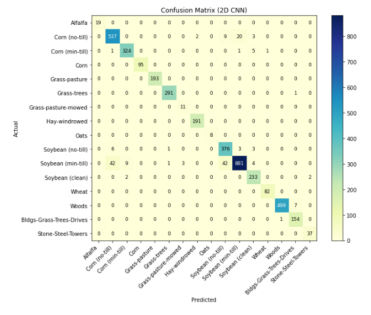  
**Interpretation:** The 2D CNN shows high accuracy in dominant classes but misclassifies minority classes due to limited spectral–spatial context.  

**3D CNN Confusion Matrix**  
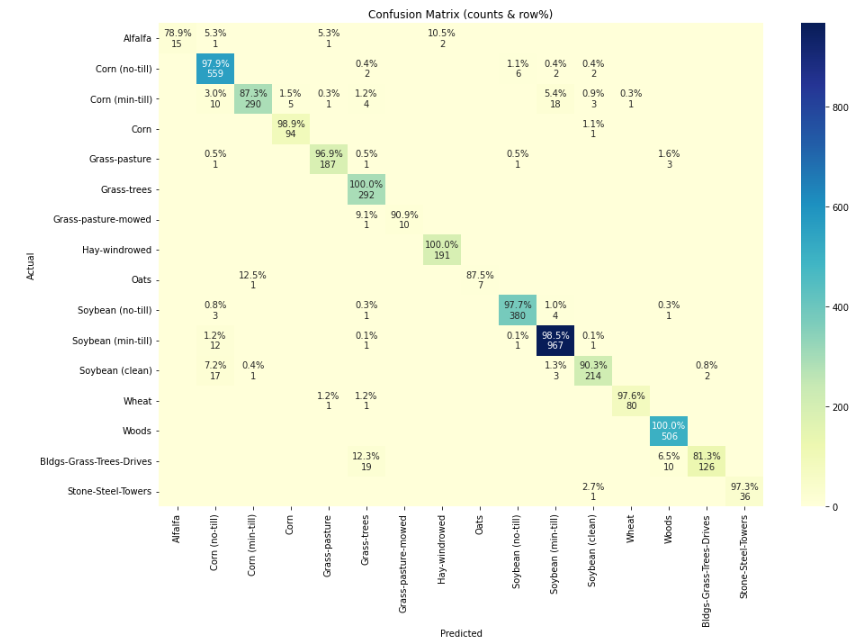  
**Interpretation:** The 3D CNN achieves improved class balance, with fewer misclassifications across minority land-cover categories.  

---

### 5.3 Classification Reports  

**2D CNN Classification Report**  
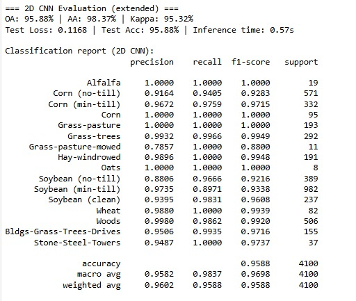  
**Interpretation:** The precision and recall values reveal that the 2D CNN favors majority classes while underperforming on rare categories.  

**3D CNN Classification Report**  
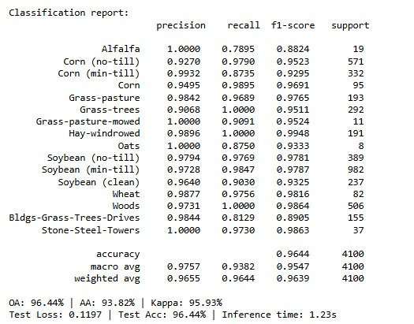  
**Interpretation:** The 3D CNN achieves consistently higher precision, recall, and F1-scores across all classes, confirming its robustness.  

---

### 5.4 Loss and Accuracy  

**3D CNN Training Curves**  
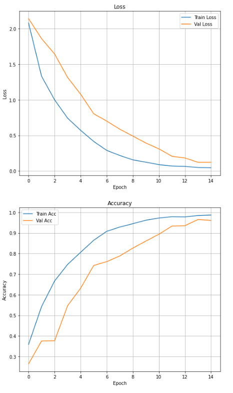  
**Interpretation:** The 3D CNN converges rapidly, with validation accuracy closely following training accuracy. This indicates minimal overfitting and strong generalization.  

## Comparison 
--- 

## 📌 Poster  
[📄 Click here to view the Poster](./poster.pdf)

## 📌 Authors

This project was developed as part of the coursework in Hyperspectral Image Classification. The primary contributors are:

Pushkar Telavane (ID:24223351 , Email: pushkar.telavane@ucdconnect.ie)

Isha Borgaonkar (ID:24209758, Email: isha.borgaonkar@ucdconnect.ie)

Both authors contributed equally to data preprocessing, model implementation, evaluation, and documentation of the project.

## 🤝 Collaboration & Networking

This project was completed through active collaboration between two students. All code, experiments, and documentation were jointly discussed and implemented.
A GitHub repository has been created to maintain version control, facilitate open collaboration, and share results with the broader research community.

## 📜 License

This project is distributed under the MIT License, which permits reuse, modification, and distribution with proper attribution. Please check the LICENSE file in the repository for more details.

## 📚 References

Our methodology and evaluation are inspired by key research contributions in hyperspectral image classification:

Chen, Y., Lin, Z., Zhao, X., Wang, G., & Gu, Y. (2014). Deep Learning-Based Classification of Hyperspectral Data. IEEE Journal of Selected Topics in Applied Earth Observations and Remote Sensing.

Hu, W., Huang, Y., Wei, L., Zhang, F., & Li, H. (2015). Deep Convolutional Neural Networks for Hyperspectral Image Classification. Journal of Sensors.

Paoletti, M. E., Haut, J. M., Plaza, J., & Plaza, A. (2019). Deep Learning Classifiers for Hyperspectral Imaging: A Review. ISPRS Journal of Photogrammetry and Remote Sensing.

Indian Pines dataset – Purdue University Research Repository.

Salinas and AVIRIS datasets – NASA Jet Propulsion Laboratory.
